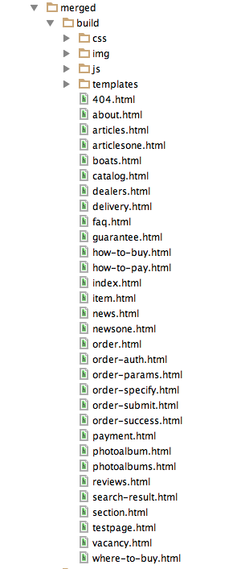

# Статичная верстка сайта http://hunterboat.ru/

Проект для создания статичной верстки и прототипирования сайта http://hunterboat.ru/.

Основан на [`project-stub`](https://github.com/bem/project-stub/tree/master/) версии
с [`bem-bl`](https://github.com/bem/bem-bl)

# Локальный запуск

```bash
 $ git clone https://github.com/alexbaumgertner/hunter-boat.git
 
 $ npm i

 $ ./node_modules/.bin/bem server

```
Страница `index` доступна по адресу http://localhost:8080/desktop.bundles/index/index.html


# Отображение картинок

Все картинки хранятся в папке `desktop.bundles/merged/img/`, чтобы включить показ картинок для страницы `index`
нужно сделать ссылку /desktop.bundles/index/img на папку с картинками:

```
 $ ln -s $(pwd)/desktop.bundles/merged/img/ $(pwd)/desktop.bundles/index/img
```

# Изменение страниц

Все страницы находятся в папке `desktop.bundles/` + название страницы, <br>
например исходник страницы index лежит
в `/desktop.bundles/index/index.bemjson.js`.

`bemjson.js` страницы можно редактировать в любом редакторе, удобнее будет поддерживающий подсветку синтаксиса javascript.

# Сборка статичной верстки

Для сборки статичной версии верстки нужно установить cssrb

```
$ npm i cssrb
```

Потом запустить скрипт `production_script.sh`:

```
$ sh production_script.sh
```

Верстка будет собрана в папке `desktop.bundles/merged/build`:

* папка `css`
* папка `js`
* папка `img` для картинок контента
* папка `templates` для картинок из css
* файлы `html` страниц


